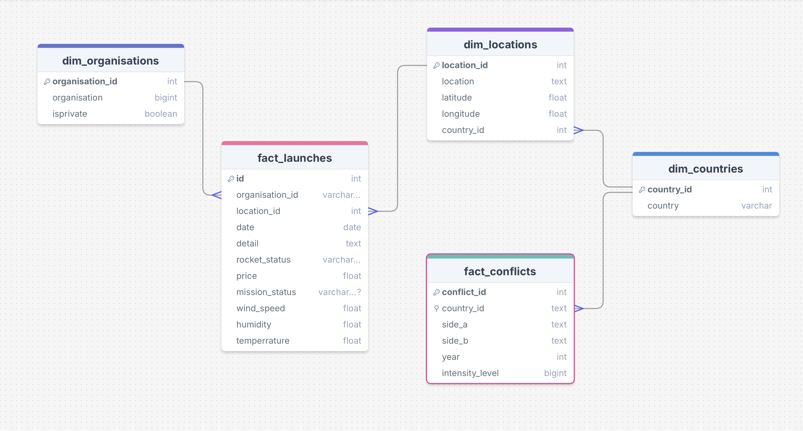

  

<!-- project philosophy -->

### Overview

This project analyzes factors influencing the success and cost of space missions, focusing on the effects of privatization, technological advancements, and environmental conditions. It also examines the impact of global conflicts on space missions.

### Key Questions

1. **Privatization Impact:** Does privatization of space missions result in higher success rates compared to government-led missions?
2. **Technological Advancements:** Has the frequency of space missions increased over time due to technological progress?
3. **Launch Locations:** Do certain launch locations have higher success rates due to better environmental conditions?
4. **Global Conflicts:** How do global conflicts affect the frequency and success of space missions?

### Approach

- **Data Sources:** Space mission data and world conflicts data.
- **ETL Process:** Cleaned, normalized, and merged data from multiple sources.
- **Models:** Developed models for predicting mission success and estimating costs.
- **Tools:** Utilized data warehousing and PowerBI for analysis and visualization.

### Objectives

- Evaluate the impact of privatization and technology on mission outcomes.
- Assess the influence of launch locations and environmental conditions.
- Analyze the correlation between global conflicts and space mission success.

This analysis aims to provide actionable insights for improving space mission strategies and understanding external impacts.

## User Stories

### User Story 1
**As a** space agency analyst  
**I want to** compare the success rates of privatized vs. government-led missions  
**So that** I can determine if privatization has led to improved mission outcomes.

### User Story 2
**As a** space mission planner  
**I want to** analyze trends in the frequency of space missions over time  
**So that** I can understand how technological advancements have influenced mission activity.

### User Story 3
**As a** launch site manager  
**I want to** evaluate mission success rates based on different launch locations  
**So that** I can identify which locations offer better environmental conditions for successful launches.

### User Story 4
**As a** global conflict researcher  
**I want to** examine how world conflicts impact the frequency and success of space missions  
**So that** I can assess if conflicts affect mission scheduling and outcomes.

### User Story 5
**As a** data scientist  
**I want to** develop predictive models for mission success and cost estimation  
**So that** I can provide actionable insights for future missions and budget planning.

### User Story 6
**As a** dashboard user  
**I want to** view interactive visualizations of mission success rates, trends, and cost estimates  
**So that** I can easily interpret data and make informed decisions.

  
<!-- Tech stack -->

### Data Management
- **SQL:** Used for querying and managing relational databases.
- **MariaDB / MySQL:** Database systems utilized for storing and managing data.

### Data Processing and Analysis
- **Python:** Primary programming language for data analysis.
  - **Pandas:** Employed for data manipulation and analysis.
  - **Matplotlib:** Utilized for data visualization and creating charts.
  - **Scikit-Learn:** Applied for building and evaluating machine learning models.
  - **SQLAlchemy:** Used for database interaction and ORM (Object-Relational Mapping).

### Data Visualization
- **PowerBI:** Created interactive dashboards and visualizations to present findings.

### Data Integration and ETL
- **ETL Process:** Extracted, transformed, and loaded data from multiple sources into a unified data warehouse.

### Additional Tools
- **DAX:** Used for creating custom calculations and measures in PowerBI.

This tech stack facilitated comprehensive data analysis, visualization, and modeling to support the project's objectives.

  

<!-- Database Design -->

### Overview

The Data Warehouse (DWH) design integrates multiple datasets to support comprehensive analysis of space mission launches, weather conditions, global conflicts, and countries. The design aims to provide a unified view for data analysis and reporting.

### Data Sources

1. **Space Launch Data:** Contains information about space missions, including success rates, launch dates, and locations.
2. **Weather Data:** Generated data including temperature, wind speed, and humidity at launch sites.
3. **Countries Dataset:** Includes details about countries for geographical and political context.
4. **Conflicts Dataset:** Contains information on global conflicts, including intensity and duration.

### Data Integration

The datasets were integrated into the DWH using the following approach:
- **Space Launch Data** was the primary dataset.
- **Weather Data** was linked to the space launch data based on launch location.
- **Countries Dataset** and **Conflicts Dataset** were joined on the country field to enrich the data with geopolitical context.

### Entity-Relationship Diagram

The Entity-Relationship Diagram (ERD) for the Data Warehouse is illustrated below. It shows the relationships between the key entities in the DWH, including space launches, weather conditions, countries, and conflicts.

This design allows for effective analysis of how weather conditions and global conflicts affect space missions, providing valuable insights for future planning and decision-making.

  

<!-- Implementation -->

### Overview

This project involves a series of steps to analyze space mission launches and their influencing factors, including privatization, technological advancements, weather conditions, and global conflicts. The implementation covers data extraction, transformation, integration, modeling, and visualization.

### Steps

1. **Data Extraction:**
   - **Space Launch Data:** Extracted from relevant sources.
   - **Weather Data:** Generated to include temperature, wind speed, and humidity at launch sites.
   - **Countries Dataset:** Collected to provide geographical context.
   - **Conflicts Dataset:** Gathered to include global conflict information.

2. **Data Transformation:**
   - **Cleaning:** Processed raw data to handle missing values and inconsistencies.
   - **Normalization:** Standardized data formats and units for consistency.
   - **Integration:** Combined datasets based on common fields, such as country, to create a unified data warehouse.

3. **Data Warehouse (DWH) Design:**
   - **Schema Design:** Developed a schema to integrate space launch, weather, countries, and conflicts data.
   - **ER Diagram:** Designed and implemented the data warehouse schema, illustrated in the ERD image (`../readme/erd.jpg`).

4. **Model Development:**
   - **Success Prediction Model:** Created using Scikit-Learn to forecast mission success based on historical data.
   - **Cost Estimation Model:** Built to estimate the cost of space missions using regression techniques.

5. **Data Analysis:**
   - **Python Analysis:** Utilized Pandas for data manipulation, Matplotlib for visualization, and Scikit-Learn for model evaluation.
   - **DAX Calculations:** Employed in PowerBI for custom calculations and measures.

6. **Visualization and Reporting:**
   - **PowerBI Dashboard:** Developed interactive dashboards to visualize key metrics, trends, and model outcomes.

### Tools and Technologies

- **SQL:** For database queries and management.
- **Python:** For data processing and model development.
  - **Pandas:** Data manipulation.
  - **Matplotlib:** Data visualization.
  - **Scikit-Learn:** Machine learning models.
  - **SQLAlchemy:** Database interaction.
- **PowerBI:** For creating dashboards and visual reports.
- **DAX:** For advanced calculations in PowerBI.

### Key Outcomes

- **Insightful Dashboards:** Provided visualizations on mission success rates, weather impacts, and conflict effects.
- **Predictive Models:** Offered predictions on mission success and cost estimates, aiding in strategic decision-making.

This implementation supports a comprehensive understanding of the factors affecting space missions and provides actionable insights for future missions.

  

<!-- Prompt Engineering -->

### Success Prediction Model

- **Algorithm:** Random Forest Classifier
- **Objective:** To predict whether a space mission will be successful or not.
- **Preprocessing:**
  - Dropped unnecessary columns such as `id`, `detail`, and `date`.
  - Handled missing values in the `price` column by filling them with the mean.
  - Converted the `mission_status` target variable into binary format (1 for Success, 0 for Failure).
  - Encoded categorical variables including `rocket_status`, `location`, `organisation`, and `country` using label encoding.
- **Training:**
  - Split the dataset into training (80%) and testing (20%) sets.
  - Trained the model using a Random Forest Classifier with 100 estimators.
- **Evaluation:**
  - Assessed the model's accuracy.
  - Provided a detailed classification report including precision, recall, and F1-score.

### Cost Estimation Model

- **Algorithm:** Random Forest Regressor
- **Objective:** To estimate the cost of space missions.
- **Preprocessing:**
  - Removed rows with missing `price` values.
  - Addressed extreme outliers in the `price` column by capping values at the 99th percentile.
  - Applied log transformation to the `price` column to stabilize variance.
  - Encoded categorical variables and normalized numerical features such as `wind_speed`, `humidity`, `temperature`, `latitude`, and `longitude`.
- **Training:**
  - Split the dataset into training (80%) and testing (20%) sets.
  - Conducted hyperparameter tuning using GridSearchCV to optimize model performance.
  - Trained the model using the best parameters found through grid search.
- **Evaluation:**
  - Measured performance using Mean Squared Error (MSE) and R-squared values.
  - Identified feature importances to understand the contribution of each feature to the cost estimation.

This section outlines the machine learning models developed for predicting the success of space missions and estimating their costs, detailing the preprocessing steps, training procedures, and evaluation metrics used to assess model performance.

  

<!-- Unit Testing -->

### Data Validation Process

To ensure the accuracy and completeness of the data in the data warehouse, the following validation steps were performed:

1. **Row Count Comparison:**
   - **Objective:** Verify that the data loaded into the data warehouse matches the original data from the CSV files.
   - **Method:** Compared the row counts of the data in the data warehouse with the row counts of the original CSV files.
   - **Process:**
     - Extracted row counts from each table in the data warehouse.
     - Extracted row counts from the corresponding original CSV files.
     - Verified that the row counts matched between the loaded data and the original files.

This validation approach ensures that the data has been accurately imported and no rows have been lost or incorrectly loaded during the ETL process. By comparing row counts, we confirm the integrity of the data migration and the correctness of the data warehouse setup.

  

## Conclusion

This project successfully demonstrated the integration and analysis of space mission data through a comprehensive data pipeline. By leveraging a data warehouse, we combined space launch data with weather, country, and conflict datasets to gain insights into mission success factors and cost estimation.

Key achievements include:
- **Data Integration:** Consolidated multiple data sources into a unified data warehouse.
- **Machine Learning Models:** Developed and validated models for predicting mission success and estimating costs.
- **Validation:** Ensured data integrity by comparing row counts between loaded data and original CSV files.

The findings highlight the impact of privatization, technological advancements, and launch location conditions on mission success. The implemented models provide valuable predictions and cost estimations, supporting informed decision-making for future space missions.

Overall, the project showcases a robust approach to data management and analysis, contributing to a deeper understanding of the dynamics influencing space missions.

